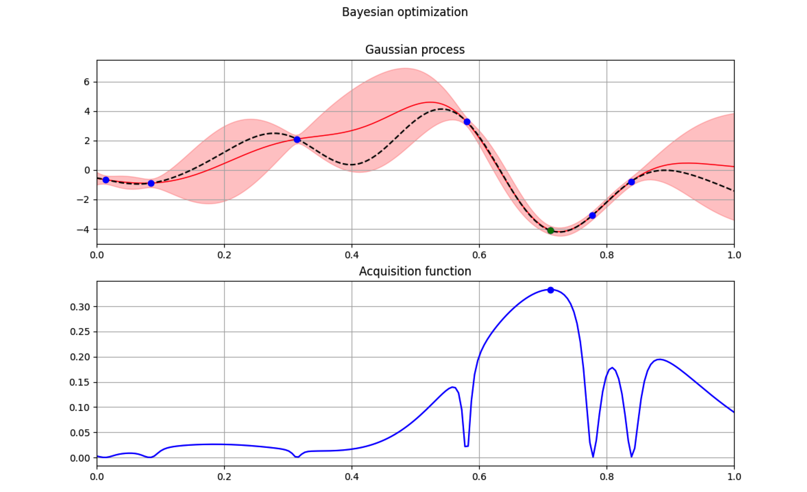

Description
=========
Reimplementation of [Entropy Search (ES)](http://www.jmlr.org/papers/volume13/hennig12a/hennig12a.pdf) in `c++`. The original code can be found [here](https://github.com/ProbabilisticNumerics/entropy-search). An alternative version that improves on efficiency of the original ES code and provides several plotting tools can be found [here](https://github.com/alonrot/userES).

	Philipp Hennig and Christian J Schuler,
	"Entropy Search for Information-Efficient Global Optimization", 
	The Journal of Machine Learning Research (JMLR),
	2012, accepted.

This code has been used to automatically tune parameters of a whole-body Linear Quadratic Regulator (LQR) for a two-legged humanoid robot to perform a squatting task. See the associated publication [here](https://arxiv.org/abs/1605.01950) and a video description of the method and the results [here](https://youtu.be/udJAK60IWEc).

	Alonso Marco, Philipp Hennig, Jeannette Bohg, Stefan Schaal, Sebastian Trimpe,
	"Automatic LQR Tuning Based on Gaussian Process Global Optimization", 
	IEEE International Conference on Robotics and Automation (ICRA),
	2016, accepted.



Authors
=======
This code has been possible thanks to a collaborative effort of the following people:
* Philipp Hennig
* Robert Eisele
* Alonso Marco

Requirements
============
This package requires:
* [yaml-cpp](https://codedocs.xyz/jbeder/yaml-cpp.svg): YAML parser and emitter in C++ ([YAML 1.2 spec](http://www.yaml.org/spec/1.2/spec.html))
* [libgp](https://github.com/mblum/libgp): C++ library for Gaussian process regression
* [cmake](http://www.cmake.org/): cross-platform, open-source build system
* [Eigen3](http://eigen.tuxfamily.org/): template library for linear algebra

Compatible versions of `yaml-cpp` and `libgp` are included along with entropy_search (this work).

Installation
============
This is a catkin package, and thus, is meant to work with an existing [ROS](https://www.ros.org/) installation. However, if you don't have ROS installed, you can still use this package by installing `catkin` and `catkin_tools` from source. See below.

1. Create a conda environment with Python 3.6:
```bash
conda create -n entropy_search python=3.6
```
In a new terminal:
```bash
conda activate entropy_search
```
Make sure you're using the correct python. For this, the command
```bash
which python
```
should show a path like the following:
```bash
<path/to/anadonda>/envs/entropy_search/bin/python
```
If it doesn't, open a new terminal and run again `conda activate entropy_search`

2. Install catking tools as follows (cf. [original instructions](https://catkin-tools.readthedocs.io/en/latest/installing.html))
```bash
sudo pip install catkin_tools
pip install --upgrade empy
```

3. Install the `catkin` package from [source](https://github.com/ros/catkin). To this end, download the source code wherever suits you best and install it.
```bash
cd <path/that/suits/me/best>
git clone git@github.com:ros/catkin.git
cd catkin
python setup.py install
```

4. Create a `catkin` workspace
```bash
mkdir -p <path/to/workspace>/src
cd <path/to/workspace>/src
git clone git@github.com:alonrot/EntropySearchCpp.git
cd <path/to/workspace>
catkin init
```

5. Compile the Entropy Search c++ code
```bash
cd <path/to/workspace>
catkin build
```
In the compilation summary, you should see `Warnings: 4 packages succeeded with warnings.`

The compiled binaries are found under
```bash
<path/to/workspace>/devel/lib/entropy_search
```
<!-- However, with `catkin`  you don't need to ever worry about looking inside such folder. Instead, you have easier access to the generated `products` (cf. [see doc](https://catkin-tools.readthedocs.io/en/latest/quick_start.html#loading-the-workspace-environment)). To grant such access, you need to source the workspace:
```bash
cd <path/to/workspace>
source devel/setup.bash
```
Then, any compiled binaries can be executed from any local path.
> The workspace cannot be sourced if the first compilation was unsuccessful. You need to compile successfully at least once for the file `<path/to/workspace>/devel/setup.bash` to exist. -->
For easier access, you can add the above path to your system PATH as
```bash
export PATH="<path/to/workspace>/devel/lib/entropy_search:$PATH"
```

You can source your workspace as
```bash
cd <path/to/workspace>
source devel/setup.bash
```
6. Install a few more packages to allow execution of python plotting scripts
```bash
pip install numpy
pip install matplotlib
pip install pyyaml
```
> This installation was tested on macOS Catalina 10.15.2, Xcode 11.3.1, git 2.21.0, pip 20.0.2

### Tips
If the compilation fails you can wipe out the catkin workspace and re-compile from scratch. To this end, use the command (see help with `catkin clean --help`)
```bash
catkin clean --deinit
```
This will delete the folders generated during compilation, i.e., 
```bash
<path/to/workspace>/build
<path/to/workspace>/devel
<path/to/workspace>/log
<path/to/workspace>/.catkin_tools
```

Example
=======
The above installation procedure compiles an example binary that illustrates how Entropy Search works in a one-dimensional problem. To run the compiled example type
```bash
runES_onedim
```
> If the above command is not found, you should add the executables path to your path (see Installation, step 5).

All the input parameters are initialized in the following configuration file:
```bash
<path/to/workspace>/src/EntropySearchCpp/entropy_search/config/input_parameters_tmpl.yaml
```

As Entropy Search runs, it logs data to external files. Such data is stored in
```bash
<path/to/workspace>/src/EntropySearchCpp/entropy_search/examples/runES_onedim/output/progress_log.yaml
<path/to/workspace>/src/EntropySearchCpp/entropy_search/examples/runES_onedim/output/tmp.yaml
```
which are rewritten at each iteration.

### Plotting
Plotting is possible in one dimensional problems. To this end, open another terminal and run
```bash
cd <path/to/workspace>/src/EntropySearchCpp/entropy_search
python plotting/plotES.py
```
A window should appear (see the figure above) with plots of the evolution of Entropy Search over iterations (unless it's the first time, in which case the window should show empty plots). Then, in the other terminal execute entropy search (i.e., run `runES_onedim`). You should see how the plotting changes as iterations pass.

> Because the plotting script and the c++ code are both writing and reading the same file (examples/runES_onedim/output/tmp.yaml), a few adjustments were made to ensure the python script doesn't crash. For example, the ES iterations are delayed on purpose a couple seconds. If you want to execute Entropy Search without plotting, simply set to false the following parameters in `<path/to/workspace>/src/EntropySearchCpp/entropy_search/config/input_parameters_tmpl.yaml`
```yaml
write2pyplot: false
```

Contact information
===================
For any questions, please, send an e-mail to: 

   alonso.marco(at)tuebingen.mpg.de